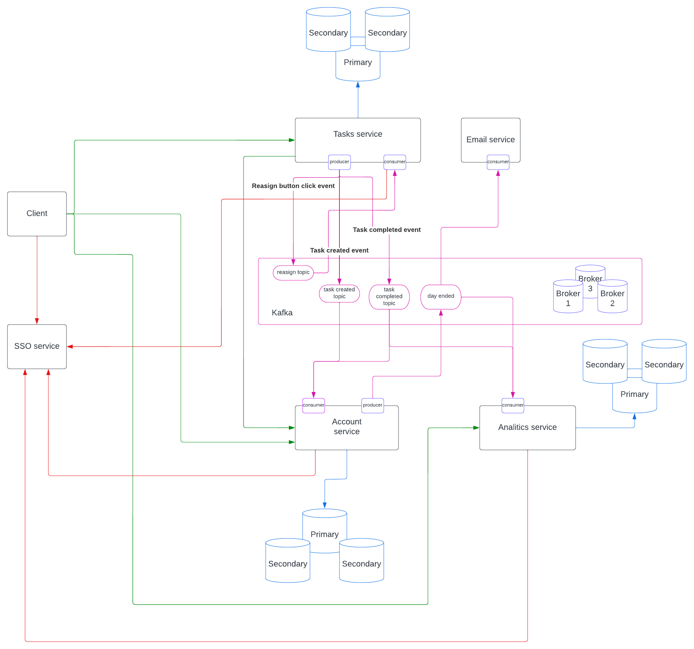

# UberPopug-Inc
Async architecture homeworks

## Стартовая архитектура

[Link to diagram](https://lucid.app/lucidchart/268f8c6b-2bed-4e3f-bc30-5b8a3003e7b6/edit?invitationId=inv_c8d8d940-e20b-4aba-8be3-4679be7bc4e9)

### Сервисы

- Task service: [сервис задач, который используется для менеджмента задач](initial-architecture/services/task-service.md)
- Account service: [сервис счетов](initial-architecture/services/account-service.md)
- Analytics service: [сервис аналитики](initial-architecture/services/analitics-service.md)
- Event service: [отправка emails](initial-architecture/services/email-service.md)

### Авторизация

- Пользователь получает авторизационный токен от SSO сервиса (токен содержит роль пользователя)
- Шлет токен с кадым запросом
- Каждый сервис проверяет токен самостоятельно

### Синхронные взаимодействия

- На схеме обозначены зеленым цветом
- Служат для запроса данных между сервисами (Task сервис может получать данные Account сервиса) или между клиентом и сервисом
- HTTP/RPC запросы

### Асинхронные взаимодействия

- В качестве брокера сообщений Kafka
- Доступные эвенты
  - Reassign button click event (служит для перемешивания незаасайненых задач)
  - Task created event (служит для оповещения об созданной таске)
  - Task completed event (служит для оповещения об выполненой таске)
  - Daily statistics event (передает статистику аккаунтов другим сервисам)
- Доступные топики
  - Reassign topic (хранит эвенты реасайнов задач)
  - Task created topic (хранит эвенты создания задач)
  - Task completed topic (хранит эвенты завершения задач)
  - Daily statistics event (передает статистику аккаунтов другим сервисам)

### GAP

- Конфликт в случае, если пользователь решил отметить такску как выполненую, но таска успела переасайниться (можно просто сделать проверку на энпоинте и выкинуть ошибку)

### Обеспечение отказоустойчивости

- Реплики баз данных
- Несколько броккеров сообщений для Kafka
- Все

### На этом все товарищи расход

