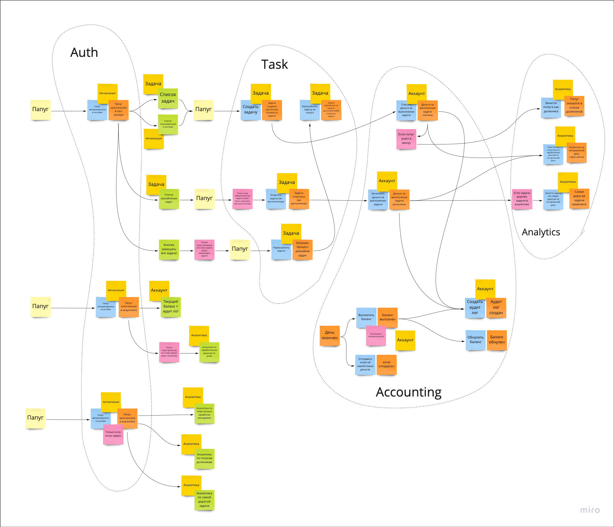
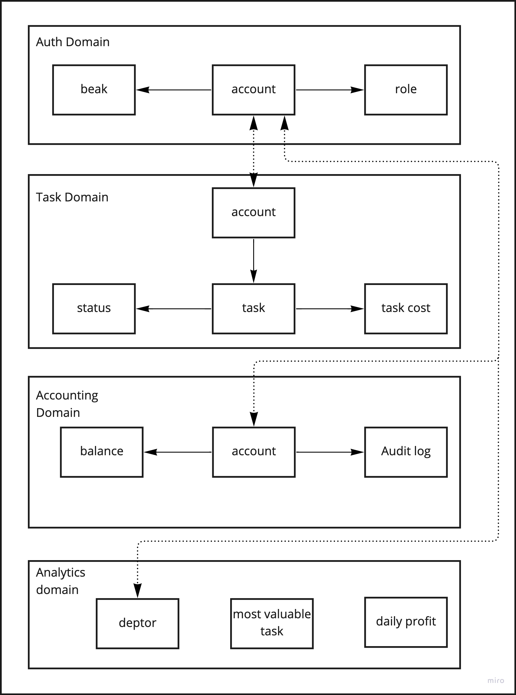

# Проектирование архитектуры

## Event Storming

[Link to the origin](https://miro.com/app/board/uXjVO5Dfe20=/?share_link_id=603034480342)

------------------------------------------------------------------------

## Data Model

[Link to the origin](https://miro.com/app/board/uXjVO5R6v8I=/?share_link_id=840808181383)

------------------------------------------------------------------------

## Services and communications

[Link to the origin](https://miro.com/app/board/uXjVO5XQM3Y=/?share_link_id=121433308978)

### Business events
| Name                  | Description                                                                                                                    | Producer           | Consumer          |
|-----------------------|--------------------------------------------------------------------------------------------------------------------------------|--------------------|-------------------|
| Task created          | Task was created in the system                                                                                                 | Task service       | Account service   |
| Task completed        | User marked task as completed                                                                                                  | Task service       | Account service   |
| Task reassign started | Admin or Manager click on 'Reassign all task button' (I made this event to have an ability to control clinking on this button) | Task service       | Task service      |
| Money debited         | Money received to the account balance of User that completed task                                                              | Accounting service | Analytics service |
| Money received        | Money debited from the account balance of User that created task                                                               | Accounting service | Analytics service |
| Balance gone negative | Balance of some User gone negative                                                                                             | Accounting service | Analytics service |

### Cud operations

* CUD operation that Account was updated, created or deleted from the Auth service to sync data managed by other services

### Sync communication

* We will use sync communication to get/send data from/to services
* To check authorization token
